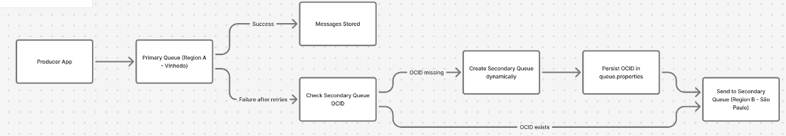

# **High Availability (HA) Solution with OCI Queue Messaging**

This solution demonstrates the resilience of a Java application (Producer and Consumer) utilizing the OCI Queue Messaging service. The system is configured to operate primarily in one region (Region A \- Vinhedo, in the example) and execute an **automatic failover** to a secondary region (Region B \- São Paulo, in the example) in case the primary queue becomes unavailable.

## **1\. Resilience Architecture Overview**

The solution implements the following HA flow:

1. **Producer (ResilientHAQueueProducer):** Attempts to send messages to the **Primary Queue** with exponential retries for transient errors.  
2. **Producer Failover:** If sending persistently fails at the Primary Queue after all retries, the Producer checks for a configured Secondary Queue OCID.  
3. **Dynamic Provisioning:** If the Secondary Queue OCID is missing or empty (meaning this is the first failover), the Producer **dynamically creates it** in the Secondary Region (via QueueManager.createSecondaryQueue()) and persists the new OCID to the queue.properties file.  
4. **Consumer (ResilientQueueConsumer):** Attempts to consume messages from the Primary Queue with retries. If all primary attempts fail, it performs an **immediate failover** and attempts to consume from the Secondary Queue.  
5. **Real-Time Consumer Update:** The Consumer calls QueueUtils.loadSecondaryQueue() **before every consumption attempt** from the secondary client. This ensures the Consumer always uses the most recent Secondary Queue OCID, immediately picking up the new OCID if the Producer dynamically created a new queue.

## **2\. Component Overview**

| File/Class | Primary Role | Configuration Dependencies |
| :---- | :---- | :---- |
| queue.properties | Configuration file for persisting the Secondary Queue OCID created during dynamic failover. | N/A |
| **QueueUtils.java** | Utility class for abstracting I/O operations (read/write) on the queue.properties file. | queue.properties (Absolute path required for the Consumer's real-time load) |
| **QueueManager.java** | Central class for managing OCI Queue clients, implementing the Producer's message sending, retry, and dynamic queue creation logic. | OCI SDK Clients (QueueClient, QueueAdminClient) |
| **ResilientHAQueueProducer.java** | The main application entry point for the Producer. Initializes the system and starts the message sending loop with HA features. | QueueManager, QueueUtils |
| **ResilientQueueConsumer.java** | The main application entry point for the Consumer. Initializes OCI clients and starts the infinite consumption loop with retry and failover logic. | QueueUtils |

## **3\. Detailed Class and Method Descriptions**

### **com.playbook.ai.QueueUtils**

Utility class to handle reading and writing the Secondary Queue OCID to the configuration file, facilitating persistence and cross-application (Producer/Consumer) updates.

| Method | Description |
| :---- | :---- |
| loadSecondaryQueueId() | **Loads the secondary queue OCID** from the properties file using a relative path (FILE\_PATH). Used by the Producer on startup. Returns null if the property is not found, which triggers dynamic creation upon first failover. |
| saveSecondaryQueueId(String queueId) | **Persists the new secondary queue OCID** to the queue.properties file. Used by QueueManager after successfully creating a new queue. |
| loadSecondaryQueue() | **Loads the secondary queue OCID** from the properties file using the defined **absolute path** (ABSOLUTE\_PROPERTIES\_PATH). This is called by the Consumer before every secondary consumption attempt, ensuring real-time configuration updates. Throws a RuntimeException if the file/property is missing, preventing operation without proper configuration. |

### **com.playbook.ai.QueueManager**

Manages client interactions, message sending, and the Producer-side failover logic, including the dynamic provisioning of the secondary queue.

| Method | Description |
| :---- | :---- |
| QueueManager(...) | Constructor. Initializes the **QueueClient** instances for both the Primary and Secondary OCI Queue endpoints based on the provided configuration. |
| sendMessage(String message) | **Producer Failover Logic:** Attempts to send the message to the Primary Queue for MAX\_RETRIES with exponential backoff. If all primary attempts fail, it checks secondaryQueueId. If the ID is empty, it calls createSecondaryQueue() and then attempts to send the message to the newly created Secondary Queue. |
| sendToPrimary(String message) | Wrapper method to send a single message using the primaryClient. |
| sendToSecondary(String message) | Wrapper method to send a single message using the secondaryClient. |
| createSecondaryQueue() | **Dynamic HA Provisioning:** Uses the **QueueAdminClient** to provision a new queue in the secondary region. It then polls the associated asynchronous *Work Request* to retrieve the final new queue OCID, and calls QueueUtils.saveSecondaryQueueId() to save the OCID for persistence and Consumer synchronization. |
| isRetryableError(Exception ex) | Utility method to check if an exception is transient (contains HTTP status codes 5xx or 429\) and should trigger a retry attempt. |

### **com.playbook.ai.ResilientHAQueueProducer**

The main class responsible for running the message production loop.

| Method | Description |
| :---- | :---- |
| main(String\[\] args) | Main entry point for the Producer. Initializes the OCI SDK provider, loads initial queue configuration, instantiates the QueueManager, and executes a loop to send a fixed number of messages (6000 in the example), relying entirely on the QueueManager for resilience and failover logic. |

### **com.playbook.ai.ResilientQueueConsumer**

The main class responsible for running the message consumption loop with built-in resilience and failover.

| Method | Description |
| :---- | :---- |
| main(String\[\] args) | Main entry point for the Consumer. Initializes the Primary and Secondary **QueueClient** instances and enters an infinite loop, periodically calling consumeWithRetryAndFailover(). |
| consumeWithRetryAndFailover() | **Consumer Failover Logic:** Implements the core consumption strategy. Tries to consume from the Primary Queue (with exponential retries). If all attempts fail, it immediately executes a failover, attempting to consume from the Secondary Queue. |
| consumeFromPrimary() | Executes the getMessages request on the primaryClient and prints consumed messages. |
| consumeFromSecondary() | Executes the getMessages request on the secondaryClient. Crucially, **it calls QueueUtils.loadSecondaryQueue()** at the start to fetch the most up-to-date Secondary Queue OCID from the configuration file, ensuring it can consume from the newly provisioned queue if failover occurred on the Producer side. |
| isRetryableError(Exception ex) | Checks if the OCI SDK exception (5xx or 429 status codes) is a temporary error that should trigger a retry attempt in the primary consumption loop. |
